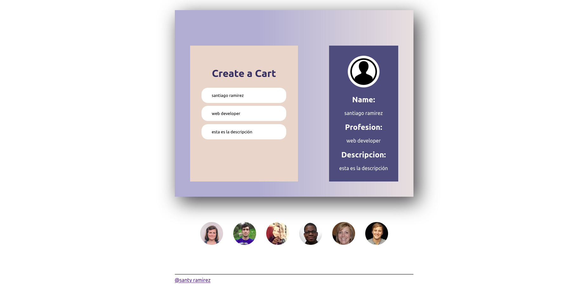

# live-card

Simple app que refleja lo que introduces en los inputs  en tiempo real, tambien hace llamado a una api:https://randomuser.me que te lista usuarios al pie del card.Para poner en práctica componentes funcionales use-ref , use-states , use-effect, paso de  props.
## Captura de pantalla:

## Deploy:

[link](https://santy-ramirez.github.io/live-card/)

## Recursos Usados:

  

   [link](https://randomuser.me)

